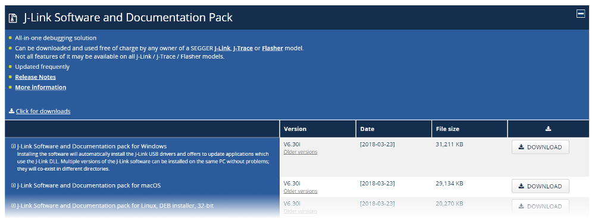

# Getting Started with your _Sense2GoL_

This guide will walk you through the setup and basic programming of your _Sense2GoL_.
It consists of 4 sections:
1. Set up the environment by installing necessary software and preparing your IDE
2. Write a simple program to make an LED blink on your _Sense2GoL_
3. Learn how to read raw data from your _Sense2GoL_
4. Make use of your data and measure speed with your _Sense2GoL_

## 1. Setting up the environment
There are several ways to get your development environment set up, depending on your favorite IDE. We've provide you with instructions for the some common IDEs.

There are only two steps to get you ready to code:
1. Install Segger J-Link
2. Prepare your IDE

### 1.1. Installing Segger J-Link
In order to use and program the Infineon XMC microcontrollers, [SEGGER J-Link](https://www.segger.com/downloads/jlink) must be installed on your PC. Please follow [this link](https://www.segger.com/downloads/jlink) and install the J-Link Software and Documentation Pack for your operating system.
If you have already installed '[DAVE™ - Development Platform for XMC™ Microcontrollers](https://www.infineon.com/cms/de/product/microcontroller/32-bit-industrial-microcontroller-based-on-arm-registered-cortex-registered-m/dave-version-4-free-development-platform-for-code-generation/channel.html?channel=db3a30433580b37101359f8ee6963814)', you can skip this step as the respective drivers/programs are already installed on your system.



### 1.2. Getting your IDE ready

#### 1.2.1. Arduino IDE
Get the ArduinoIDE from [here](https://www.arduino.cc/en/Main/Software). Open it and select your board and port (under "Tools → Board" and "Tools → Port).

You can start coding, building, uploading and monitoring right away. Make yourself familiar with it! (Help can be found [here](https://www.arduino.cc/en/Guide/Environment))


#### 1.2.2. PlatformIO
Get PlatformIO from [here](https://platformio.org/platformio-ide). Open it, create a new project and choose your board in the wizard.

The `platform.ini` file should look similar to this (depending on your board, here we used a Sense2GoL):
```platform.ini
[env:xmc1300_sense2gol]
platform = infineonxmc
board = xmc1300_sense2gol
framework = arduino
```

You can start coding, building, uploading and monitoring right away. Make yourself familiar with it! (Help can be found [here](https://docs.platformio.org/en/latest/ide/pioide.html))

#### 1.2.3. Visual Studio Code + Arduino Extension
Get Visual Studio Code from [here](https://code.visualstudio.com/download), install die Arduino extension and restart VS Code.


Next, select your board and port in the bottom right corner.


You can start coding, building, uploading and monitoring right away. Make yourself familiar with it! (Help can be found [here](https://marketplace.visualstudio.com/items?itemName=vsciot-vscode.vscode-arduino))

## 2. Making an LED blink

To make an LED blink on your _Sense2GoL_, there are just two steps necessary:
1. Set-up the board
2. Let the LED blink

### 2.1. Set-up the board
For the `setup()` method, we only have to set the `LED1` pin to `OUTPUT`, so we can control the LED:
```arduino
void setup() // This code is executed once for the initial setup
{
  pinMode(LED1, OUTPUT); // Set our LED as an output, so it can be controlled
}
```

### 2.2. Let the LED blink
Next, we want to light up the LED in the `loop()` method. 

This looks as follows:
```arduino
void loop() // The following code is repeatedly executed
{
  digitalWrite(LED1, HIGH);  // Turn on the LED
  delay(500);                // Wait 0.5 seconds
  digitalWrite(LED1, LOW);   // Turn off the LED
  delay(500);                // Wait 0.5 seconds
}
```
`digitalWrite(LED1, HIGH)` turns the LED on, `delay(500)` waits half a second before turning the LED off again.


### 2.3. Watch it blink
Upload your code to the _Sense2GoL_ and watch your LED blink 🚨💡

Congrats! You just managed to talk to your board 👏

## 3. Reading raw data
While a blinking LED is cool, it's not at all useful. Let's read some raw data from your _Sense2GoL_ to get to the exciting things.

Three steps are necessary for this:

1. Prepare the board
2. Read the data
3. Receive the data on your computer

### 3.1. Preparing the board
For the `setup()` method, there are two things we have to before being able to read out raw data.

#### 3.1.1. Opening a serial port
First, we need to initialize a serial port connection.

This is done by:
```arduino
  Serial.begin(9600);
  Serial.println("Init done!");
```

`Serial.begin(bitrate)` opens a serial connection and sets the bitrate for transmission via that connection. This transmission rate is also known as _Baud-Rate_ and must match on the board side and on the computer side. For our _Sense2GoL_ this rate is 9600 (for other boards you can find the rate in the documentation).

#### 3.1.2. Turning on the board
Second, the _Sense2GoL_ requires the `BGT_ON` pin to be turned on before it is possible to read data from the board.

This is done by:
```arduino
void setup()
{
  Serial.begin(9600);
  Serial.println("Init done!");

  // Only necessary when directly communicating with the board
  pinMode(BGT_ON, OUTPUT);
  digitalWrite(BGT_ON, LOW); // Turn on the board
}
```

In this case `LOW` is enabled state, because TODO REASON. There is a slight difference when you have the _Sense2GoL_ connected to another board. Please see below for that.

Otherwise, that's it already for the setup.

#### 3.1.3. Connecting the _Sense2GoL_ to another board
If you want to connect the _Sense2GoL_ to another microcontroller, you have to activate the `BGT_ON` pin beforehand. This is done by uploading the following very simple script directly to the _Sense2GoL_:
```arduino
#include <Arduino.h>

void setup()
{
  pinMode(BGT_ON, OUTPUT);
  digitalWrite(BGT_ON, LOW); // Turn on the board
}

void loop()
{
}
```

After that, you can simply connect the `VCCIN` (5V power) and `GND` (ground) to the respective pins of your board and connect the data pins `IF_I_HG` and `IF_Q_HG` to some analog inputs of your board. 

Obviously, you don't have to include the code to activated the `BGT_ON` pin anymore in your `setup()` method, because you did this by uploading the above script to the _Sense2GoL_.

Now, you're all set up for the loop 😉.

### 3.2. Reading the data
Next, we want to read the raw data in the `loop()` method. The board outputs the raw data on the `CH_I` (channel I) and the `CH_Q` (channel Q) pins (if you're not directly communicating with the _Sense2GoL_, replace with the respective analog input pins of your board). What we have to do is simply read those to pins and print their content to the serial port connection, so it appears on the serial console on our computer.

This looks as follows:
```arduino
void loop()
{
  Serial.print(analogRead(CH_I));   // Read and print I
  Serial.print(' ');
  Serial.println(analogRead(CH_Q)); // Read and print Q
}
```

``analogRead(pin)`` reads the raw data from a pin. ``Serial.print(text)`` and ``Serial.println(text)`` send the raw data to the serial connection.

The whole code looks like this:
```arduino
#include <Arduino.h>

void setup()
{
  Serial.begin(9600);
  Serial.println("Init done!");
	
  // Only necessary when directly communicating with the board
  pinMode(BGT_ON, OUTPUT);
  digitalWrite(BGT_ON, LOW); // Turn on board
}

void loop()
{
  Serial.print(analogRead(CH_I));   // Read and print I
  Serial.print(' ');
  Serial.println(analogRead(CH_Q)); // Read and print Q
}
```

### 3.3. Receiving the data
If you compiled and uploaded the code to the board, it will read the raw data and send it to the serial connection. On your computer, you can see it arriving by opening a serial monitor (such as that from the ArduinoIDE).

The arriving data will look like this:
```
375 384
446 352
503 352
558 379
```
You should see the values changing when you're moving the board or some object in front of it.

Congrats! You just managed to read data from your radar sensor 👏

## 4. Measuring speed
Now, let's leave the playground and get to some real project, making use of our data. Did you always wanted play the cop and measure the speed of cars? You've got the hardware to do that and here comes the code for your radar gun.

Three steps are necessary for this:

1. Create a class for the Sense2Go, which is able to read the data
2. Implement a class for the data processing, especially for the FFT
3. Bootstrap the two classes and print speed

### 4.1. Sense2GoL class
Let's start with implementing a class for the Sense2GoL. So far, it doesn't need to do much. Mainly, we want to read the IQ data.

We'll assume a header file defining the class and its functions. If you wanna check it out, you can do so [here]().

The implementation is quite simple:
```arduino
Sense2GoL::Sense2GoL(RADAR_CONFIG_t radarConfig)
{
    _config = radarConfig;

    // turn on radar
    #ifdef XMC1300_Sense2GoL
    pinMode(BGT_ON, OUTPUT);
    digitalWrite(BGT_ON, LOW);
    #endif
    analogReadResolution(12u);
}
```

The constructor just turns on the `BGT_ON` pin, which is necessary to read data (this is a peculiarity of the Sense2GoL).
```arduino
Sense2GoL::~Sense2GoL() {}
```

The dispose function is empty so far. We could theoretically turn off the `BGT_ON` pin again...
```arduino
void Sense2GoL::sampleInQ(int16_t *bufferI, int16_t *bufferQ)
{
    for (uint16_t i = 0; i < _config.fftSize; i++)
    {
        bufferI[i] = analogRead(CH_I);
        bufferQ[i] = analogRead(CH_Q);
        delayMicroseconds(_config.samplingTime);
    }
}
```

This is the most important function for this part. We're getting two buffers and read the IQ data into them. The delay and the length is determined by the `Sense2GoL` specs in the `_config`.

### 4.2. RadarDataProcessor class
That was easy. The `RadarDataProcessor` will be more complex. The header file again takes care of defining functions and variables.

This is the constructor:
```arduino
RadarDataProcessorClass::RadarDataProcessorClass(Sense2GoL *radar, void (*cb)(RESULT_t *result))
{
    _fft = FFTAnalyzer(); 
    _maxMagFreq = {0, 0};
    _result.speed = 0.0;
    _result.maxMagnitude = 0;
    _result.motion = 0;
    _radar = radar;

    if (cb)
        _cb = cb;

    _radarFftSize = (_radar->_config).fftSize;

    _fftOrder = log2(_radarFftSize);

    initHanningWindow(_radarFftSize);
    _freqWidth = (_radar->_config).samplingRate / _radarFftSize;
}
```

We are going to use the `FFTAnalyzer` from the `DSP` library for computing the FFT. Essentially, we're initializing some variables in this snippet, such as the radar class `_radar` and the callback `cb`. We're also initializing the Hanning window.

The code for that looks like this:
```arduino
void RadarDataProcessorClass::initHanningWindow(uint8_t windowLength)
{
    // w(n) = 0.5 (1-cos(2*pi*n/(N-1))), 0<=n<=(N-1)
    float frac = TWO_PI / (windowLength - 1);
    for (int i = 0; i < windowLength; i++)
        _hanningWindow[i] = round(32767 * (1 - cos(i * frac))) >> 1;
}
```

What happens is that preparing the Hanning window values and store them in `_hanningWindow[]`. The length is determined by the `_radarFftSize`.

Next, we have a wrapper function for the sampling from the radar:
```arduino
void RadarDataProcessorClass::sampleInQ(void)
{
    _radar->sampleInQ(_result.dataI, _result.dataQ);
}
```

And another wrapper function for the FFT function. Why we need those two wrapper functions, will become clear later on, when we're scheduling those to tasks after each other.
```arduino
void RadarDataProcessorClass::runAlgorithm()
{
    computeFft();

    if (_cb)
    {
        _cb(&_result);
    }

    _available = true;
}
```

The FFT is computed and the `_result` is passed to the callback function `cb`.

The core part is now the implementation of `computeFft()`:
```arduino
void RadarDataProcessorClass::computeFft()
{
    // mean removal
    int sum = 0;
    for (int i = 0; i < _radarFftSize; i++)
    {
        sum += _result.dataI[i];
    }
    sum = sum >> _fftOrder;

    // windowing -> move to fft analyzer
    for (int i = 0; i < _radarFftSize; i++)
    {
        _result.realI[i] = FIX_MPY((_result.dataI[i] - sum), _hanningWindow[i]);
        _result.imagI[i] = 0;
    }

    // in-place fft
    _fft.fix_fft(_result.realI, _result.imagI, _fftOrder, 0);

    //the first half of real fft values replaced by power spectrum
    _maxMagFreq = _fft.compute_magnitude(_result.realI, _result.imagI, _result.magnitudes, _radarFftSize / 2);
    bool detected = _maxMagFreq.mag > (_radar->_config).fftThreshold;

    if (detected)
        _result.speed = (RATIO_FREQ_TO_SPEED * _freqWidth * _maxMagFreq.freq);
    else
        _result.speed = 0;
    _result.maxMagnitude = _maxMagFreq.mag;
}
```

There are several steps here. First we sum up the I values to get the mean. Next, the mean is substracted from every data point and the `_hanningWindow` is applied.

The preprocessed data is passed to the `fix_fft()` function and the magnitudes for the first half of the `_radarFftSize` is computed by `compute_magnitude()`. It also returns the highest magnitued. Since the FFT magnitudes are mirrored and we're only interested in the absolute speed, not the direction, we can skip the second half of magnitudes.

If the maximum magnitude `_maxMagFreq.maq` exceeds the `fftThreshold`, we're converting it to a velocity and store it in `_result.speed`. Below the threshold the returned speed is 0.

### 4.3. The rest
This was the hard part. All we have to do now, is connecting the dots.

In our `main.ino` we'll declare some variables:
```arduino
bool available = false;
float speed;
Sense2GoL *radar;
RadarDataProcessorClass *processor;
int _interruptTimer;
int _timer;
```

The `setup()` function looks like this:
```arduino
void setup()
{
  Serial.begin(9600);
  radar = new Sense2GoL(/** your config goes here */);
  processor = new RadarDataProcessorClass(radar, callback);

  // configure task to be executed periodically
  _timer = addTask(samplingTask);

  if (_timer < 0 || _timer > NUM_TASKS_VARIANT)
  {
    // error: too many tasks
    return;
  }

  setParam(_timer, _timer);
  setInterval(_timer, (radar->_config).cycleTime);
  startTask(_timer);

  _interruptTimer = addTask(algoTask);

  // use as an interrupt
  setParam(_interruptTimer, _interruptTimer);
  setInterval(_interruptTimer, 1);

  Serial.println("Init done!");
}
```

The serial connection is opened, the `Sense2GoL` initialized and passed to the `RadarDataProcessor` along with the `callback()`. 

```arduino
void callback(RESULT_t *result)
{
  speed = result->speed;
  available = true;
}
```

The callback just writes the resulting speed into `motion` and sets a flag, that a new result is `available`.

Now, we're making use of the scheduler included in the Infineon XMC core. The `_interruptTimer` takes care of sampling some new IQ data from our `Sense2GoL`. Its interval is that of our radar, namely the `cycleTime`. After the data is sampled, the `_interruptTimer` is started to process the fresh data.
```arduino
void samplingTask()
{
  processor->sampleInQ();
  startTask(_interruptTimer);
}
```

`_timer` will execute the `algoTask()`, which is our FFT, and stop its own execution afterwards.
```arduino
void algoTask(int taskId, int16_t param)
{
  processor->runAlgorithm();
  deleteTask(_interruptTimer);
}
```

Lastly, the `loop()` function displays the results, whenever there are new results `available`:
```arduino
void loop()
{
  if (available)
  {
    Serial.println(speed);
    available = false;
  }
}
```

### Done 🏁
And that's it! Build and upload the whole code. Then open the Serial port from the console below and watch the speedometer display the speed of the things you move in front of your board. Have fun playing!

<iframe width="100%" height="870px" src="../assets/iframes/develop/showSpeed/index.html"></iframe>

## 5. Door Opener

Here comes the explanation of the code.

### 5.1. Code

TODO

### 5.2. See it at work

Here is your door opener. Choose your port and baudrate and hit start. Try approaching your door opening sensor and watch the doors open. It doesn't open when you're moving away from it!

<iframe width="100%" height="620px" src="../assets/iframes/develop/doorOpener/index.html"></iframe>


## Done 🏁
That's it! You're all set up now and know how to program your _Sense2GoL_ 💪 Go ahead and learn what your radar chip is capable of by visiting the [Interactive Radar Tutorial](radarTutorial.md)