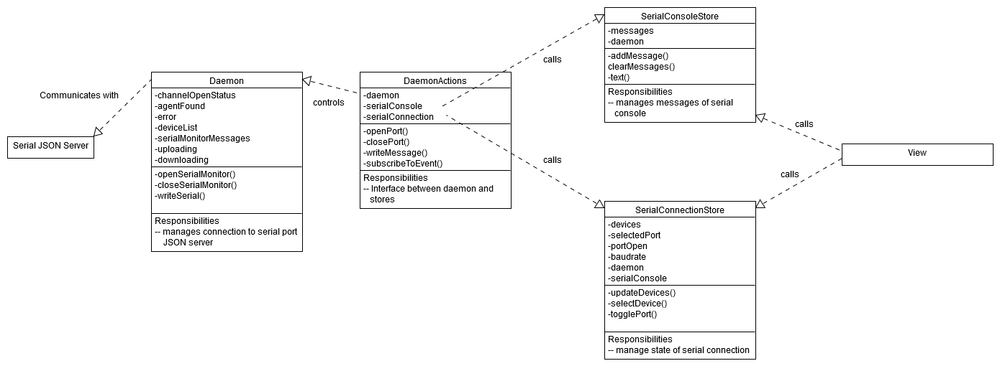

# Developer Notes

This document summarizes the development decisions and workflows in order to guide developers on how to setup the project themselves.

There are the following sections:
1. Quick Start: Local setup, running and building
2. Utilized Tools: List containing all used tools
3. Overall Design Considerations
4. NPM script documentation
5. Folder Structure
6. Data Flow
7. Deployment

## 1. Development Environment Setup
### Prerequisites
We'll be assuming you have the following software already installed on your computer
1. [NodeJS](https://nodejs.org/en/download/)
2. [Git](https://git-scm.com/downloads)

### Install
To develop with this repository, you need to clone it first.

```
git clone REPO_URL
```

Navigate to the repo folder and open the CLI of your choice to run:

```
npm install
```

This installs all the dependencies (including devDependencies) from the `package.json`.

### Run/Serve
Running the project takes just one command (well, one npm command):

```
npm start
```

This starts docsify, which serves your documentation per default to `localhost:3000`. Beforehand, `webpack` bundles your dependencies and watches your files and its configuration so that it automatically reloads if there are any changes. Consequently, you've got the full peace of mind. Just start coding and see the changes instantly appear on the screen!

### Building
There also is an npm script for building, namely `npm build`. It lints your code, runs webpack in development mode and executes the tests. This is untested so far and should be considered a placeholder for how a build script could look like. A real build script should optimize and minify files et cetera.

## 2. Utilized Tools
1. [Docsify](https://docsify.js.org/#/): Automatic Documentation Generator
2. [Arduino Create Agent JS Client](https://github.com/arduino/arduino-create-agent-js-client) JS implementation of Arduino Create Agent to interact with our boards via serial port.
2. [Webpack](https://webpack.js.org/): Dependency Bundler
3. [Babel](https://babeljs.io/)/[Babel Loader](https://github.com/babel/babel-loader): JS transpiler for unified language version and browser support
4. [ReactJS](https://reactjs.org/): Front end library
5. [mobx](https://github.com/mobxjs/mobx): Data-flow and state management for react components library
5. [RMWC](https://jamesmfriedman.github.io/rmwc/): UI library wrapping Material Components in React components


## 3. Overall Design Considerations
`Docsify` was used for its beautiful and effortlessly to write documentation. It suffices for generating a nice web documentation for our project, however we wanted to have interactive elements using data from the board.

`Arduino Create Agent` is very feature rich and was therefore prefered over [Chilipeppr](http://chilipeppr.com/), which is better documented but cannot flash software on the board for example. `Arduino Create Agent` has few documentation, but is well maintained and mature as it is used for the [Arduino Web IDE](https://create.arduino.cc/editor). It can flash software on the board and even load drivers, which are very sophisticated features. Both `Chilipeppr` and `Arduino Create Agent` are based on the [Serial Port JSON Server](https://github.com/johnlauer/serial-port-json-server), which needs to run locally on the users machine.

To use the common package manager `npm` but still run the scripts on the client side, `Webpack` bundles the dependencies in a single file, injected in the `index.html`. It also bundles the source code and transpiles it to ES2015 using `Babel` and `Babel Loader` for interoperability with dependencies and to work on older browsers.

Concerning the dynamic frontend code, `ReactJS` is the go-to library for rendering UI elements in a structured way is  . [AngularJS](https://angularjs.org/) is an equally powerful and popular alternative and was disregarded only because of personal preference. For the same reasons [Material Components Web](https://material.io/develop/web/) was selected as the CSS framework. The [official React implementation](https://github.com/material-components/material-components-web-react) is in fact less mature than `RMWC` (as of now) and was therefore disfavored.

`mobx` is a [Flux](https://facebook.github.io/flux/) inspired data flow architecture to manage states of `React` components. Compared to `Flux` and implementations like [AltJS](http://alt.js.org/), `mobx` removes a lot of boilerplate code and yet remains unopinionated on the way the data changes occurs (essentially removing `actions`). This especially leads to out-of-the-box support for `async` and external data alterations and is a huge advantage over otherwise popular [Redux](https://redux.js.org/), because the `daeomon` of `Arduino Create Agent JS Client` updates the data unregularly when there state of the serial connection changes (new message via serial port, new board connected, ...).


## 4. Documentation of NPM Scripts
### 1. webpack:dev
Runs webpack in development mode and watches the files for changes, to automatically rebuild on changes. Additionally `nodemon` watches for changes of the webpack config file and restarts webpack.

### 2. webpack:prod
Runs webpack in production mode.

### 3. docsify
Makes docsify serve the documentation in `docs/`. Default serving location is `localhost:3000`.

### 4. lint
Executes ESLint checks on all `*.js` files contained in `docs/`.

### 5. test
Empty so far, can be used for (unit) tests.

### 6. start
Runs webpack:dev and docsify in parallel using `npm-run-all`. This bundles the files and reloads them on changes, while serving the docs via docsify.

## 5. Folder Structure
- Root Folder
    - docs
        - assets
            - images
            - iframes
                - commons
                    - bundle shared dependencies of the iframes
                    - created by webpack
                - section folders ...
                    - iframe folders ...
                        - dist
                            - bundled js by webpack
                        - src
                            - actions
                                - services for communication with the daemon, fft, ...
                            - components
                                - React components
                            - stores
                                - mobx stores
                                - data model
                            - app.js
                                - React Entry Point
                            - app.scss
                                - SASS imports
                                - additional CSS

                        - index.html
                            - entry point
                            - loads the bundled dependencies from commons
                            - loads the bundles js form dist
        - includes
            - include pages (such as sidebar, navbar, coverpage, 404 page)
        - pages
            - all content pages (*.md files)
        - index.html
        - README.md
- config files (webpack, bable, eslint, git, package.json)

## 6. Data Flow


## 7. Deployment
Deployment has yet to be setup properly. So far the contents of the `docs` folder are manually copied to the `howto.makeradar.com` directory on the webspace. Since this is a git repository, webhooks could be setup to trigger a `git pull` on the webserver.
